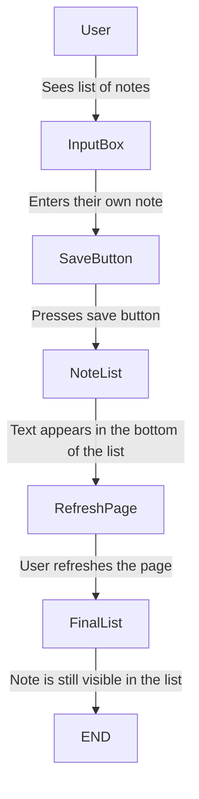

```mermaid
flowchart TD;
  User --> |Sees list of notes| InputBox;
  InputBox --> |Enters their own note| SaveButton;
  SaveButton --> |Presses save button| NoteList;
  NoteList --> |Text appears in the bottom of the list| RefreshPage;
  RefreshPage --> |User refreshes the page| FinalList;
  FinalList --> |Note is still visible in the list| END;
```
